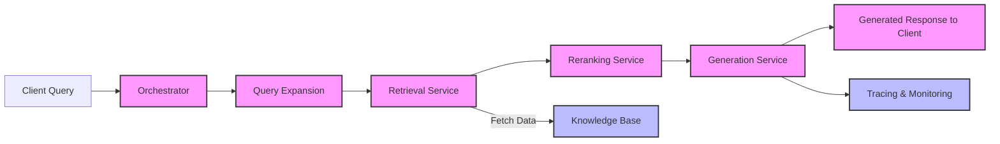

# oxford-genai-capstone
Oxford GenAI Course Capstone project.

## Project
This is an example project for the Oxford GenAI course.

### Structure
The repository has the folllowing tree structure:

```
├── LICENSE
├── README.md
├── rag-app
│   ├── Makefile
│   ├── data
│   ├── deploy
│   │   ├── cloudformation
│   │   ├── docker
│   │   │   ├── llm-server
│   │   │   │   └── docker-compose.yml
│   │   │   └── postgres
│   │   │       ├── deduplicate.sql
│   │   │       ├── docker-compose.yaml
│   │   │       ├── init_pgvector.sql
│   │   │       └── pgvector.Dockerfile
│   │   └── scripts
│   ├── poetry.lock
│   ├── pyproject.toml
│   ├── server
│   │   ├── __init__.py
│   │   ├── config
│   │   │   ├── dev.yaml
│   │   │   └── prod.yaml
│   │   └── src
│   │       ├── __init__.py
│   │       ├── config.py
│   │       ├── config_loader.py
│   │       ├── controllers
│   │       │   ├── __init__.py
│   │       │   ├── generation.py
│   │       │   ├── health_check.py
│   │       │   ├── rag_pipeline.py
│   │       │   └── retrieval.py
│   │       ├── database
│   │       │   ├── __init__.py
│   │       │   ├── db_session.py
│   │       │   └── vector.py
│   │       ├── ingestion
│   │       │   ├── __init__.py
│   │       │   ├── arxiv_client.py
│   │       │   ├── embeddings.py
│   │       │   ├── pipeline.py
│   │       │   └── utils.py
│   │       ├── main.py
│   │       ├── models
│   │       │   ├── __init__.py
│   │       │   ├── document.py
│   │       │   ├── generated_response.py
│   │       │   ├── query.py
│   │       │   └── user_interaction.py
│   │       ├── services
│   │       │   ├── __init__.py
│   │       │   ├── generation_service.py
│   │       │   └── retrieval_service.py
│   │       └── settings.py
│   ├── test.json
│   └── tests
│       └── services
│           ├── __init__.py
│           ├── test_generation_service.py
│           └── test_retrieval_service.py
└── requirements.txt
```

This is based around the classic controller/service architecture, utilising FastAPI, PostgresQL and Ollama (for local LLM serving) and Amazon Bedrock (for remote LLM serving)

Here is a diagram outlining the main logical components of the application and how data flows through the app.:


### Usage

### Deployment


## Resources

#### General / RAG

1. https://blog.lancedb.com/guide-to-use-contextual-retrieval-and-prompt-caching-with-lancedb/
2. https://huggingface.co/learn/cookbook/agent_rag
3. https://docs.astral.sh/ruff/formatter/#format-suppression

#### Agentic RAG
1. https://github.com/cobusgreyling/LlamaIndex/blob/d8902482a247c76c7902ded143a875d5580f072a/Agentic_RAG_Multi_Document_Agents-v1.ipynb
