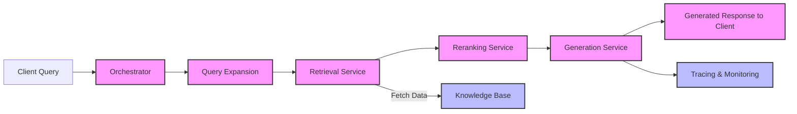

# _Artificial Intelligence: Generative AI, Cloud and MLOps (online), University of Oxford_: Capstone Project
## Introduction and Background
Oxford GenAI Course Capstone project. The aim of this project is to help students understand some of the key concerns and process flows required for AI engineering.

### What is AI engineering?
For the purposes of this course we use the term ‘AI engineering’ to refer to:
The discipline of building end-to-end applications that leverage Artificial Intelligence.
Note that this definition will also include within it the related concept of ‘Machine Learning Engineering’ (ML Engineering), which we consider a subset. These concepts will be explained in more detail in the rest of this document.

### What do AI engineers do?
Given the above description, AI engineering is necessarily concerned with AI systems in a relatively holistic sense and so it may prove difficult to succinctly define all activities that fall within its scope. The development of this field over the past 2-3 years, in particular, has however suggested a convergence on a certain set of activities that are core to the discipline:

* Software Engineering Best Practice
* Infrastructure & Cloud engineering.
* Data processing.
* Prompt Engineering.
* Orchestration.
* Model and System Performance Validation.
* Model and System Performance Monitoring.
* API Integration Engineering.
* System Design and Deployment Patterns.

Those who are aware of the disciplines of ML Engineering & Machine Learning Operations (MLOps) will see a lot of overlap in terms of these topics (with the exception of 3). This course module will help you build skills and knowledge in the area of AI engineering by building on a foundation of core MLOps practice and then extending these skills for the era of Foundation Models and Generative AI.

### Background Reading
As part of this course you have all been provided with an e-copy of [Machine Learning Engineering with Python, 2nd Edition](https://www.packtpub.com/product/machine-learning-engineering-with-python-2nd-edition/9781801078031) by Andrew P. McMahon. We will use this book to develop our core skills in AI engineering before augmenting it with new material.

The book is fundamentally a book about machine learning engineering, which can be thought of as a precursor to AI engineering. Many of the core foundational concepts from ML engineering carry over into AI engineering.

To augment your learning from the lectures in the course, the following topics are covered in the identified chapters in the book. I would suggest reading these and following some of the coding exercises within the book to prepare you for the capstone project (discussed in a later section):

1. Software Engineering Best Practice:
  * The ML and AI Development Lifecycle [Chapter 2.3]
  * Software Engineering & Python Fundamentals [Chapter 1.5, 4.1, 4.2 and 4.5]
  * CI/CD with GitHub Actions [Chapter 2.3 and 5.6]

2. Infrastructure & Cloud engineering:
  * AWS Services & AWS CLI [Throughout the book]
  * Kubernetes [Chapter 6.4 and 8.7]

3. Data Processing & Storage:
  * ETL Fundamentals [Chapter 6]
  * Apache Spark [Chapter 6.2]
  * Ray [Chapter 6.5]

4. Prompt Engineering:
  * Basic Langchain [Chapter 7.2]

5. Orchestration.
  * Apache Airflow [Chapter 5.6, 9.4 and 9.5]
  * Kubeflow [5.7]

6. Model and System Performance Validation & Monitoring [Chapter 3, Chapter 5, Chapters 8 & 9].

7. System Design and Deployment Patterns:
  * AI Application Patterns:
    * One-shot Q&A [Chapter 7.2]

This capstone project will build on some of the topics covered in the material above and provide a specific AI engineering bent to it. See details on the Project for more.


## Project
This project will complement the background study material with guided hands on work on the following topics:

1. CI/CD - you will learn how to use GitHub Actions in order to automate the testing and deployment of your code base. You will also learn how to use Makefiles to simplify complex application builds.
2. Docker - you will learn how to use containerisation to build microservices required for an AI use case.
3. AWS - you will learn what cloud services available in AWS are useful for AI applications and will get to know how to programmatically access them. This will include using the flagship AWS Bedrock service for foundation model serving.
4. LLM Traces - you will learn how to implement open source tools that allow you to monitor, track and debug interactions with LLMs in your application.
5. Advanced RAG- you will learn how to take a naive RAG implementation that does basic retrieval and generation and augment it with techniques such as query expansion. Importantly you will do this *without* using an off-the-shelf framework and will code everything natively in Python. This will give you insights into what goes on under the hood in the most popular libaries and frameworks.
6. Guardrails - We will explore how to apply Bedrock guardrails to protect against undesired outcomes in our AI application.
7. Databases - You will use Postgresql, one of the most popular production ready databases in the world, along with its `pgvector` extension to store and manipulate vectorised embeddings.
8. Ollama - We will use the Ollama solution in order to run LLMs locally for development and testing of your application, before moving to cloud hosted Foundation Models.

Other concepts which will be utilised in this project that are covered in the book in detail are:

9. Testing - You will see how to write advanced tests for async functions, for data intensive functions and for AI workflows.
10. Functional Programming (and more Python fundamentals) - This project is written in a functional style and will show you how to write code that is readable and maintainable even when not using Object Orientated Programming (OOP). The code will also show you how to write modular code that is easy to test, extend and adapt to multiple use cases.
11. Config driven development - We'll show you can leverage strong configuration principles in order to reduce duplication and make your code more maintainable.


### Structure
The repository has the folllowing tree structure:

```
├── LICENSE
├── README.md
├── rag-app
│   ├── Makefile
│   ├── data
│   ├── deploy
│   │   ├── cloudformation
│   │   ├── docker
│   │   │   ├── llm-server
│   │   │   │   └── docker-compose.yml
│   │   │   └── postgres
│   │   │       ├── deduplicate.sql
│   │   │       ├── docker-compose.yaml
│   │   │       ├── init_pgvector.sql
│   │   │       └── pgvector.Dockerfile
│   │   └── scripts
│   ├── poetry.lock
│   ├── pyproject.toml
│   ├── server
│   │   ├── __init__.py
│   │   ├── config
│   │   │   ├── dev.yaml
│   │   │   └── prod.yaml
│   │   └── src
│   │       ├── __init__.py
│   │       ├── config.py
│   │       ├── config_loader.py
│   │       ├── controllers
│   │       │   ├── __init__.py
│   │       │   ├── generation.py
│   │       │   ├── health_check.py
│   │       │   ├── rag_pipeline.py
│   │       │   └── retrieval.py
│   │       ├── database
│   │       │   ├── __init__.py
│   │       │   ├── db_session.py
│   │       │   └── vector.py
│   │       ├── ingestion
│   │       │   ├── __init__.py
│   │       │   ├── arxiv_client.py
│   │       │   ├── embeddings.py
│   │       │   ├── pipeline.py
│   │       │   └── utils.py
│   │       ├── main.py
│   │       ├── models
│   │       │   ├── __init__.py
│   │       │   ├── document.py
│   │       │   ├── generated_response.py
│   │       │   ├── query.py
│   │       │   └── user_interaction.py
│   │       ├── services
│   │       │   ├── __init__.py
│   │       │   ├── generation_service.py
│   │       │   └── retrieval_service.py
│   │       └── settings.py
│   ├── test.json
│   └── tests
│       └── services
│           ├── __init__.py
│           ├── test_generation_service.py
│           └── test_retrieval_service.py
└── requirements.txt
```

This is based around the classic controller/service architecture, utilising FastAPI, PostgresQL and Ollama (for local LLM serving) and Amazon Bedrock (for remote LLM serving)

Here is a diagram outlining the main logical components of the application and how data flows through the app.:


## Usage
The Makefile has been designed so that building and running the capplication and its components is as simple as possible.

To build the database:

```
make build-db
```

To download the data locally:

```
make download-data
```

To run the ingestion pipeline:

```
make run-ingestion
```

To run the FastAPI app:

```
make run-app
```

To run the tests

```
make test
```

To build the ollama service:

```
make build-ollama
```

To run the ollama service:

```
make run-ollama
```

Then to destroy the components, stop the app and then:

```
make remove-ollama
make remove-db
```

### Deployment


## Resources

#### General / RAG

1. https://blog.lancedb.com/guide-to-use-contextual-retrieval-and-prompt-caching-with-lancedb/
2. https://huggingface.co/learn/cookbook/agent_rag
3. https://docs.astral.sh/ruff/formatter/#format-suppression

#### Agentic RAG
1. https://github.com/cobusgreyling/LlamaIndex/blob/d8902482a247c76c7902ded143a875d5580f072a/Agentic_RAG_Multi_Document_Agents-v1.ipynb
